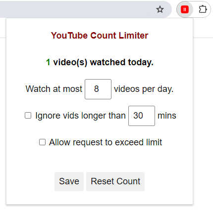

### Changelogs
v0.2 (June 2024) - implemented ignoring long videos and bypass; new UI

v0.1 (May 2024) - initial prototype with limit and reset count

# YouTube Daily Count Limiter

This is a simple chrome extension that limits the number of videos you watch per day to avoid addiction.

The flyout settings page.

The blocked screen with the bypass button.

### Features
1. Blocks youtube page after daily limit is reached
2. A popup menu that lets you set the daily limit and a button to reset the counter for today
3. Number of watched videos will be cleared everyday
4. Watching a video more than once will not count towards the quota
5. When the limit is reached, a button appears and can be clicked to bypass current limit
6. Set a video length threshold with videos longer than which will be ignored (for background music) 

### Why not just limit usage using screentime?
Not all videos are made equal; If you limit YouTube usage by time, then for the same amount of time you may watch a ton of short videos, or a few longer videos. I believe the latter is less detrimental to one's attention span. In fact, one could argue certain long educational videos (such as online tutorials, topical video essays) should not be considered entertainment at all and should not be restricted to the same level as "top 10 funny cat" videos.

This is why the extension is built in a way that encourages viewer to watch more complete and long videos, as well as finishing each video instead of being addicted to short dopamine hits.

In a way, while screentime can reduce eyestrain but limiting actual time spent looking at screens, this count limiter is positioned to help with your attention span. They serve a different propose and you can definitely use both at the same time.

### Installation
Enable developer mode (upper right corner) under `chrome://extensions` and then drag the Extension folder into chrome window. This will load the unpacked extension.

### Todos:
- [ ] Setting to ignore music videos (background listening)
- [x] Setting to ignore videos shorter or longer than threshold
- [x] A "please" button to bypass the limit

Feel free to suggest more features and find bugs!